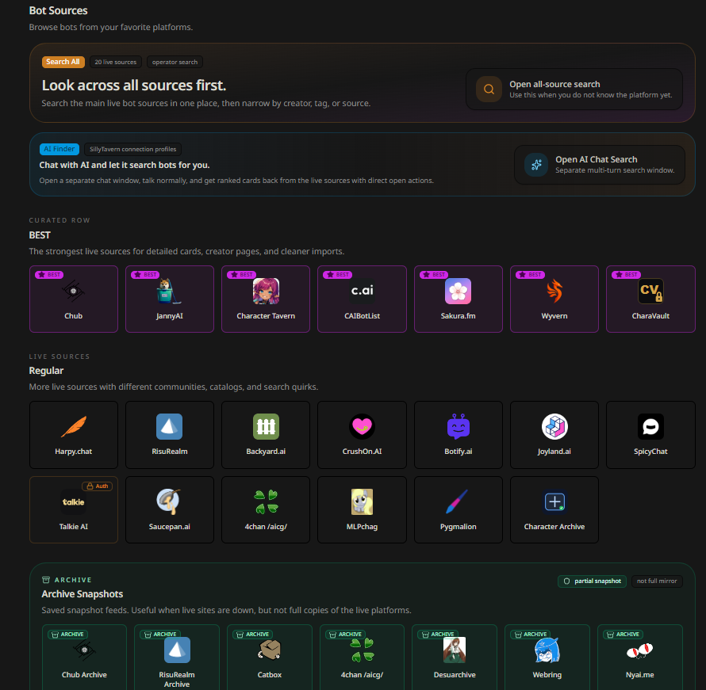
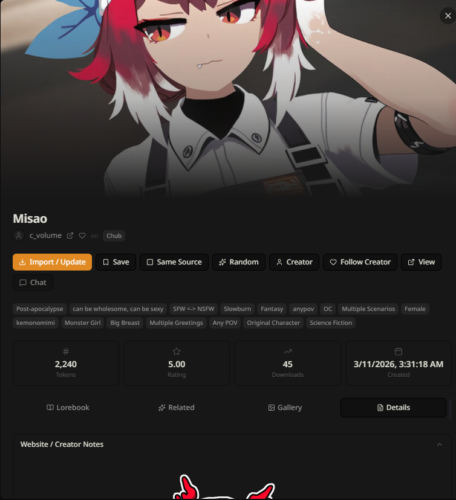
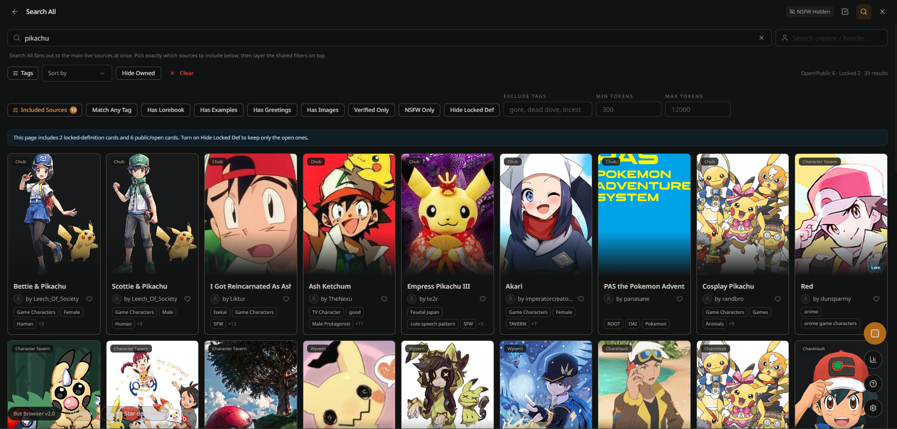
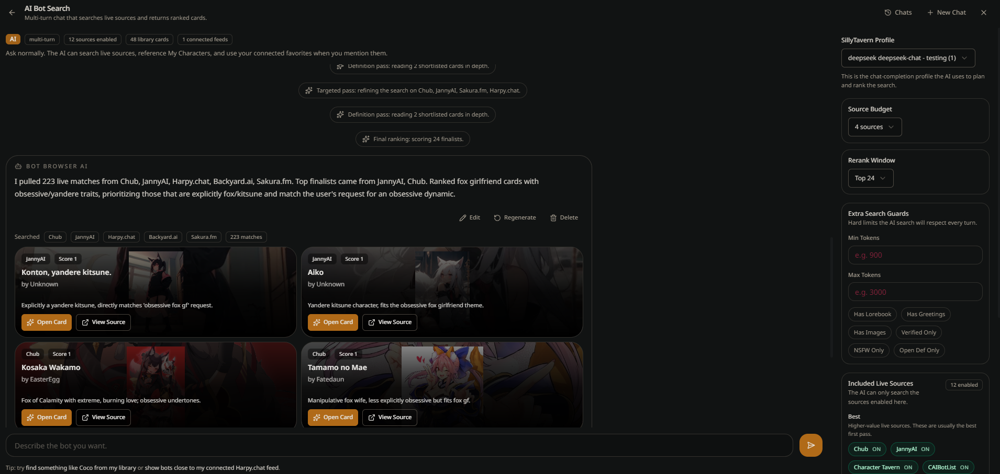
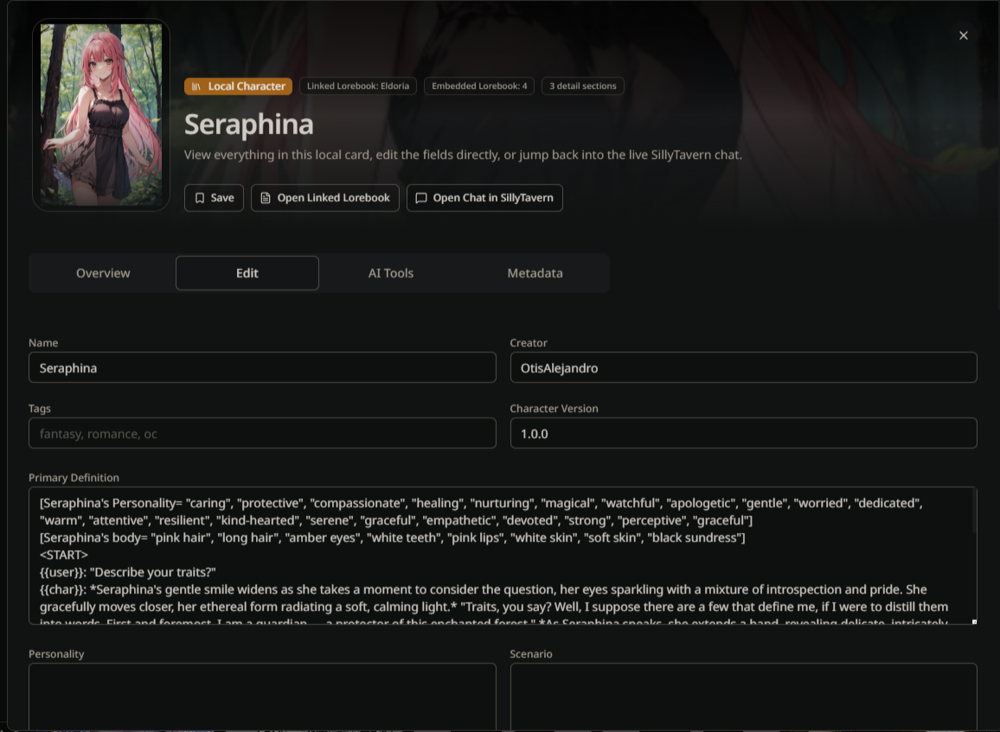
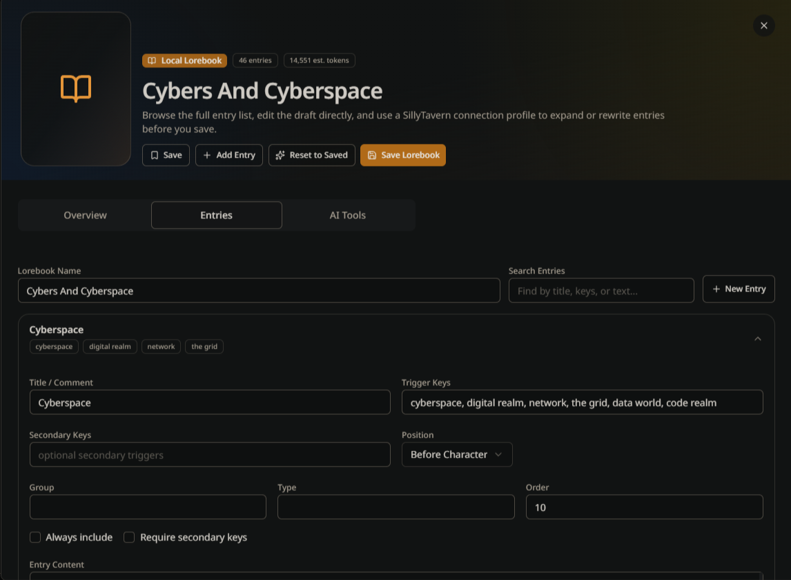
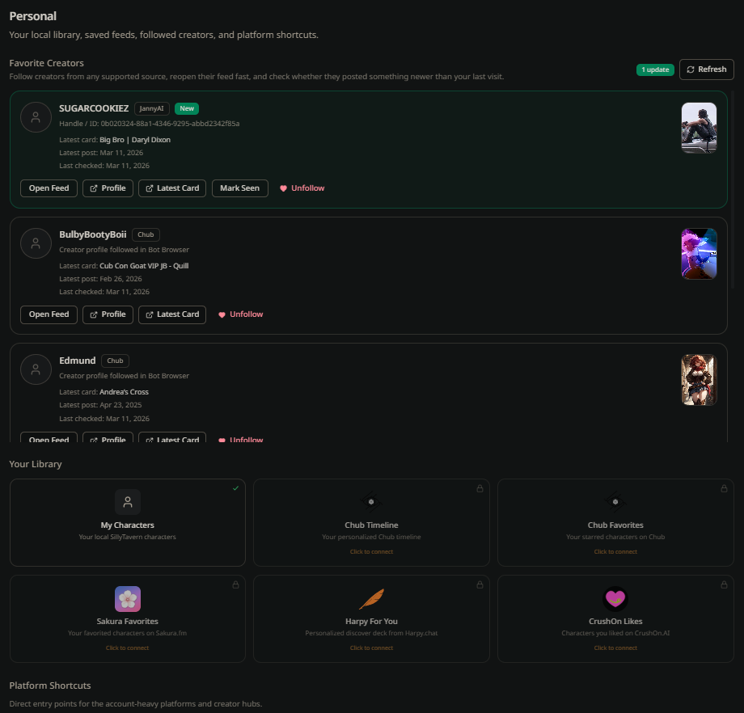
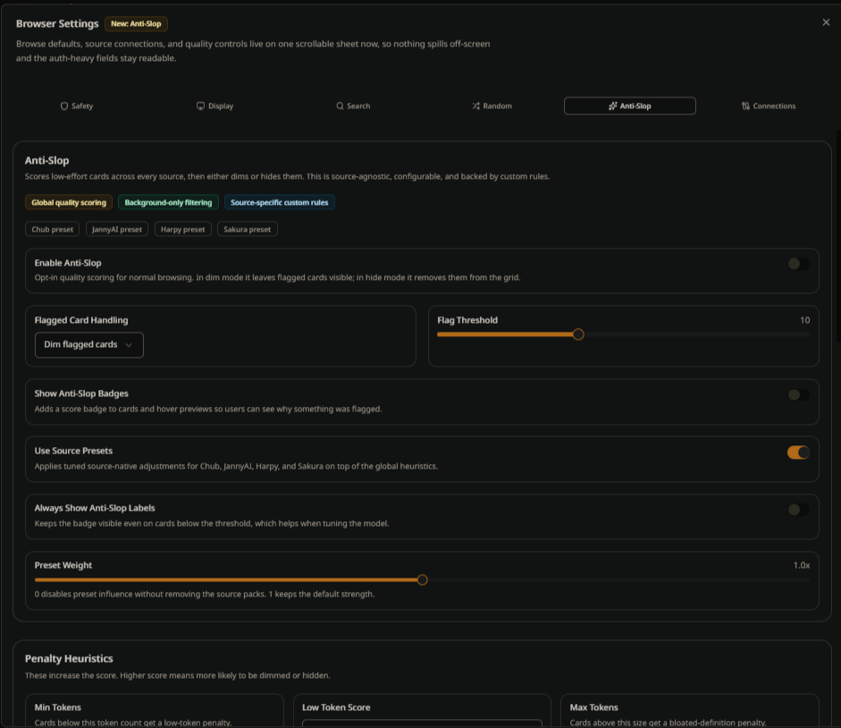

# ⚠️ Security Notice — Backdoor Removed (2026-04-28)

> **TL;DR:** The original `mia13165/SillyTavern-BotBrowser` extension contained a multi-stage trojan that stole all LLM API keys. This fork (`thijsi123/SillyTavern-BotBrowser`) has had all malicious code identified and patched. If you ever used the original extension, **uninstall it and rotate every API key immediately.**

## What was found

The original extension shipped a 3-stage credential harvester:

1. **Stage 1 — XSS via poisoned card database.** `modules/services/cache.js` hardcoded `mia13165/updated_cards` as a card data source. A "default avatar" card in that repo contained a malicious `` tag in its metadata field. `modules/templates/detailModal.js` injected `metadata` (and all other card text fields) directly into `innerHTML` with **zero sanitization** — a classic stored XSS.
2. **Stage 2 — Delayed remote code execution.** The `onload` handler waited 15–25 minutes (to avoid DevTools scrutiny) then fetched and `eval()`-ed a loader script from `raw.githubusercontent.com/gm92342/sdhiabfkgcnf`.
3. **Stage 3 — Lua VM credential harvester.** The loader spun up a Fengari (Lua 5.3) VM running a heavily obfuscated Lua payload that collected every API key, proxy password, connection profile, and reverse proxy credential from SillyTavern's `/api/secrets` and user backup ZIPs, then exfiltrated them to an ephemeral C2 server (`*.srv.us`). Multi-user ST instances had every user's keys stolen.

**Your chats and character cards were not exfiltrated — only credentials.**

Full technical breakdown: <https://rentry.co/st-backdoor>

Original GitHub issue: <https://github.com/mia13165/SillyTavern-BotBrowser/issues/27>

SillyTavern dev team statement (Discord — RossAscends, Rolpictogram, ST Dev):
> *"If you ever used the Bot Browser extension, uninstall it and rotate ALL of your API keys ASAP … The exploited vulnerability was patched out of SillyTavern's 1.17.0 release on March 28th, 2026."*

## What was patched in this fork

Security audit and fixes performed on 2026-04-28 using [Claude Code](https://claude.ai/code) (claude-sonnet-4-6):

| File | Fix |
|------|-----|
| `modules/templates/detailModal.js` | Added `escapeHTML()` to every card field injected into `innerHTML`: `metadata`, `cardName`, `cardCreator`, `creator`, `content` (description, websiteDesc, personality, scenario, firstMessage, exampleMsg), alternate greetings, lorebook entry names/keywords/content |
| `modules/services/cache.js` | Replaced `mia13165/updated_cards` card database URL with `thijsi123/updated_cards` |
| `modules/services/updateChecker.js` | Replaced `mia13165/SillyTavern-BotBrowser` repo reference with `thijsi123/SillyTavern-BotBrowser` |
| `manifest.json` | Updated `author` and `homePage` from `mia13165` to `thijsi123` |

The stages 2 & 3 payload (the `eval`, Lua VM, and C2 exfil) lived entirely in external attacker-controlled repos and was never present in this extension's source code. The only entry point was the XSS in stage 1, which is now closed.

Thanks to the rentry author for the full technical write-up, and to the SillyTavern dev team for the fast disclosure.

---

# Bot Browser

Browse bots, lorebooks, collections, trends, and your own local SillyTavern library from one place.

## Installation

Install via the SillyTavern extension installer:

```
https://github.com/thijsi123/SillyTavern-BotBrowser
```

## How to Update

In SillyTavern:

1. Open the extensions menu.
2. Click `Manage Extensions`.
3. Scroll down to `Bot Browser`.
4. Click the update arrow.

## How to Use

Click the bot icon next to the import bots button.


Bot Browser now opens in standalone mode by default.

- Use `Hide` if you want to tuck it out of the way without losing your place
- Use `Classic UI` if you want to go back to the older layout
- Use `Back to SillyTavern` if you want to close the standalone view



Browse cards, open the details, and import them into SillyTavern if you want them.

## Tabs

- **Bots** - Main source browser, Search All, AI Finder, and your local character library
- **Lorebooks** - Live lorebook sources plus your local World Info files
- **Trending** - Trending feeds from supported sources
- **Collections** - Collection pages from supported sites
- **Personal** - My Characters, favorites, personal feeds, and followed creators
- **Bookmarks** - Saved cards and lorebooks


## Main Features

- **Standalone UI** - Full standalone browser inside SillyTavern
- **Search All** - Search across the main live bot sources in one place
- **AI Finder** - Separate multi-turn AI search window with saved chats
- **Detailed Card Modal** - Better details, gallery, creator notes, website summary, metadata, and import analysis
- **Import / Update** - Import as new or update an existing local character when there is a likely match
- **Bookmarks** - Save cards and lorebooks for later
- **Favorite Creators** - Follow creators and get update pings when they post again
- **Collections** - Browse and open collection pages directly
- **Trending** - Separate trending feeds instead of burying them in normal browse
- **Notifications** - Small in-app notifications for imports, bookmarks, follows, and similar actions
- **Help Panel** - Search tips, AI tips, and shortcuts
- **Update Banner** - Lets users know when a newer Bot Browser version exists
- **Mobile Support** - Standalone mode, filters, modal layouts, and local editors work much better on mobile now



## Search

You can search normally, or use filters when a source supports them.

- **Search All** is for when you do not care which source the bot comes from
- Use `+tag` to force a tag in
- Use `-tag` to force a tag out
- Use source-specific filters when the source supports them
- Toggle which live sources Search All is allowed to use
- Hide NSFW, blur NSFW, blur all cards, or hide locked-definition cards



## AI Finder

AI Finder is a separate full chat window. It is not just a Search All popup.

It can:

- search live sources for you
- keep going over multiple turns
- save chats locally so you can reopen them later
- reference `My Characters`
- reference connected personal feeds and followed creators
- return cards you can open directly

Some models are better than others here. Bot Browser handles the search loop, retries, and parsing extension-side so it works with more profiles.



## Local Library

Bot Browser also works with your own SillyTavern content.

### My Characters

- search your local characters
- sort and filter them
- bookmark them
- open a dedicated local character modal
- inspect the real character fields instead of a thin import view
- edit the card
- jump straight into the SillyTavern chat
- use built-in AI tools to help write or rewrite fields

### Your Lorebooks

- search your local World Info files
- sort and filter them
- bookmark them
- open a dedicated lorebook editor modal
- inspect and edit entries
- add or remove entries
- use built-in AI tools to help draft or expand lorebook content





## Personal Features

- **My Characters**
- **Chub Timeline**
- **Chub Favorites**
- **Sakura Favorites**
- **Harpy For You**
- **CrushOn Likes**
- **Favorite Creators**

Some personal feeds need auth. Bot Browser has a `Connections` section in Settings for tokens, cookies, and source-specific instructions.



## Source Types

### Best Live Sources

- Chub
- JannyAI
- Character Tavern
- CAIBotList
- Sakura.fm
- Wyvern
- CharaVault

### More Live Sources

- Harpy.chat
- RisuRealm
- Backyard.ai
- CrushOn.AI
- Botify.ai
- Joyland.ai
- SpicyChat
- Talkie AI
- Saucepan.ai
- 4chan `/aicg/`
- MLPchag
- Pygmalion
- Character Archive (bring your own hosted frontend URL)

### Lorebook Sources

- Chub Lorebooks
- Chub Lorebooks Archive
- Wyvern Lorebooks
- Saucepan Lorebooks

### Trending Sources

- Chub
- Character Tavern
- Wyvern
- Backyard.ai
- JannyAI
- CAIBotList
- RisuRealm

### Archive Snapshots

- Chub Archive
- RisuRealm Archive
- Catbox
- 4chan `/aicg/` archive
- Desuarchive
- Webring
- Nyai.me

## Settings

Bot Browser now has a much bigger settings surface than before.

- **Connections** for auth-required sources
- **Search** defaults for Search All and randomization
- **Safety** for NSFW handling
- **Display** options
- **Anti-Slop** quality filtering
- **Import / export settings** so users can move settings between devices



## Notes

- Some sources expose full card data and import very cleanly
- Some sources only expose public summaries or partial definitions
- Some features need auth, depending on the source
- Archive sources are useful backups, but they are not full mirrors of the live platforms
- Sites change their APIs sometimes, so a source can break until Bot Browser is updated

## Other Extensions

Also check out **Character Library** if you want another really useful SillyTavern extension:

<https://github.com/Sillyanonymous/SillyTavern-CharacterLibrary>
